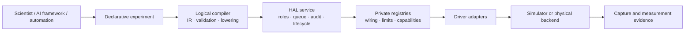

# Analog Fabric HAL Playground

A vertical-slice reference architecture for a programmable analog fabric: declarative experiments, compiler-style validation, private driver adaptation, safe queued control, measurement evidence, and simulator-versus-backend parity.

> **Scope:** this is an educational toy HAL and architecture prototype—not a production instrument-control system and not a claim of real hardware integration.

## At a glance

| Demonstrated now | Production work still needed |
|---|---|
| Arbitrary topology, declarative experiments, batch programming, source/capture jobs, role admission, power jobs, audit events, parity demos | Real vendor drivers, calibration data, authenticated identities, safety interlocks, robust recovery, multi-device coordination |

## Quick start

1. Run `python3 demo.py` for the nominal 4×4 experiment and expected backend parity match.
2. Run `python3 demo_nonideal.py` for the intentional simulator-versus-backend difference.
3. Run `python3 demo_full_matrix.py` for a dense 4×4 feedforward matrix.
4. Run `python3 demo_recurrent.py` for the dense 8×8 input/output feedback matrix.
5. Run `python3 -m unittest -v` to verify the toy HAL behavior.
6. Edit `demo_experiment.json` to describe another logical use case.

## Demos

### Demo 1 — nominal parity

The bundled `four_port_mixer` experiment demonstrates:

- queued power-on and safe-stop;
- input waveform dispatch and output capture through logical ports;
- four accepted edge-weight updates and one rejected invalid weight;
- observer/operator role separation;
- explicit verification of edge `0 -> 2` at `0.4 V` and edge `0 -> 3` at `0.24 V`;
- matching simulator and driver-backed results.

### Demo 2 — expected nonideal parity difference

`python3 demo_nonideal.py` applies a deterministic profile of `gain = 0.92` and `offset = 0.01 V` to the driver-backed observations. The expected simulator values of `0.4000 V` and `0.2400 V` become approximately `0.3780 V` and `0.2308 V`. A parity mismatch is the correct outcome: it represents a calibration or regression signal, not a queue, authorization, or dispatch failure.

### Demo 3 — fully connected matrix fabric

`python3 demo_full_matrix.py` shows the most direct fully connected use case: all 16 edges of a 4-input, 4-output fabric are programmed as a weight matrix, four analog input values are applied, and the simulator renders the resulting matrix-vector output. It is the clearest demonstration that the graph representation can express a dense analog neural layer.

### Demo 4 — 8×8 input/output feedback fabric

`python3 demo_recurrent.py` presents the connectivity view in the supplied matrix example. It combines `in1..in4` and `out1..out4` into eight logical nodes, then programs every matrix entry: 64 edges in total. Each feedback step applies all four blocks—input-to-input, output-to-input feedback, input-to-output feedforward, and output-to-output. Negative paths are labeled inhibitory and positive paths excitatory. The demo is an honest discrete-time, brain-inspired teaching model; it is not a biological brain model or PDE solver.

| Matrix convention | Meaning |
|---|---|
| Row | Receiving node. |
| Column | Sending node. |
| Upper-left 4×4 block | Input-to-input paths. |
| Upper-right 4×4 block | Output-to-input feedback paths. |
| Lower-left 4×4 block | Input-to-output feedforward paths. |
| Lower-right 4×4 block | Output-to-output recurrent paths. |

The ordinary HAL fabric remains a directional `inputs × outputs` graph. Demo 4 is a small, explicit recurrent-state layer built on top of that idea so the back-and-forth connectivity can be inspected in one table. It performs `state(next) = tanh(W × state(now))` for a fixed number of steps.

## Declarative experiment API

`demo_experiment.json` is the high-level use-case request. It states **what** experiment is desired; it does not expose driver names, cables, or safety sequencing.

| Field | User-facing meaning |
|---|---|
| `name` | Human-readable experiment name used in the compiler trace. |
| `network.inputs`, `network.outputs` | Logical fabric shape. |
| `weights` | Source port, destination port, and signed weight for each requested edge update. |
| `inputs` | Logical input port, voltage samples, and sample rate. |
| `captures` | Logical output ports to capture. |
| `measurements` | Explicit verification experiments with known stimulus and tolerance. |
| `power_on`, `safe_stop` | Whether to submit the lifecycle jobs around the experiment. |

Execution path: request → typed experiment → logical IR → validation → queued HAL jobs → evidence and audit records.

## Assumptions

- The intended physical computation is continuous-time analog signal processing; the simulator uses samples as a testable approximation.
- Public values use SI units: volts, amperes, seconds, and hertz.
- Edge weights are logically signed; physical hardware may lower them to differential positive/negative paths.
- Every edge owns one fixed transfer-function identifier, plus optional delay and bandwidth. Its weight alone is reprogrammable. The toy simulator ships with `linear` and `tanh`; it can register device-specific functions such as `square`, a filter response, or a named calibrated transfer. A physical backend is responsible for mapping those fixed identifiers to actual hardware structures.
- Driver signatures are fixed external contracts. The HAL adapts them rather than changing them.
- Multiple clients may submit requests, but one shared device owns one serialized hardware worker.
- No driver readback is assumed. Desired state and observed/verified state are intentionally separate.

## Design choices

| Choice | Why |
|---|---|
| Logical API, private wiring | Algorithms name edges and ports, not instruments or cables. |
| Compiler-style IR and validation | Makes requested behavior inspectable before dispatch. |
| One hardware queue | Prevents conflicting access to shared instruments. |
| Per-item batch results | Large batches report exactly which updates failed and why. |
| Cancellation only between operations | A fixed driver call is treated as atomic hardware work. |
| Dispatch is not verification | A returned driver call only proves dispatch; measurement produces evidence. |
| Capability-based adapters | RFSoC and AWG-plus-Scope can provide the same logical source/capture capability. |
| Private device registry | Port attachments, voltage/bandwidth limits, bias groups, and power metadata are not user-controlled. |
| Role-based admission | Unprivileged requests are denied before entering the hardware queue. |
| Backend parity contract | Simulator and driver-backed paths implement the same logical experiment operations. |
| Explicit recurrent teaching model | The 8×8 demo makes feedback visible without claiming that the production HAL already exposes recurrent-device hardware. |

## Risks and failure conditions

| Condition | HAL response or current limitation |
|---|---|
| Invalid port, topology, weight, or waveform limit | Reject before driver dispatch. |
| Driver accepts a call but changes nothing | Mark dispatch as unverified; require a measurement job. |
| Backend/simulator difference | Report parity difference for calibration or regression investigation. |
| Driver timeout or communication loss | Production backend must mark state unknown and enter recovery; the MVP only models this concept. |
| Concurrent clients | Serialize work through one worker. |
| Cancellation | Finish the current atomic operation, then cancel remaining work. |
| Safe-stop failure | Attempt all output-capable adapters and report failures; real interlocks remain future work. |
| Unauthorized action | Deny before queue admission and record the actor in the audit log. |
| Noise, drift, calibration error | Demo 2 models a deterministic mismatch; waveform analysis and calibration fitting are future work. |

## Developer contracts and requests

### Application and AI-framework developers

Please provide logical operations, waveform ranges and timing, expected output tolerances, required verification strength, batch/retry/cancellation needs, and any learning or adaptation rule. The HAL should return logical job status, item-level outcomes, evidence, and limits—not instrument-specific details.

### Driver and hardware developers

Please provide fixed method signatures, valid ranges and units, resolution and settling time, atomicity, timeout/failure behavior, safe-start/safe-stop sequences, shared-resource conflicts, capture timing, calibration data, and a way to observe hardware effects where direct readback is unavailable.

The current fixed contracts are `VoltageSource`, `Memory_controller`, `AWG`, `Scope`, and `RFSoC`. `poll_driver(attribute)` is private and resolves logical capabilities such as edge-weight, waveform-source, and waveform-capture.

## Current implementation

| Module | Responsibility |
|---|---|
| `analog_fabric.py` | Arbitrary-shape graph, compiler validation, IR rendering, sampled analog simulator. |
| `experiment_api.py` | Declarative JSON experiment request and typed conversion. |
| `service.py` | Serialized jobs, batch results, measurement evidence, lifecycle, audit integration, role admission. |
| `drivers.py` | Fixed driver contracts and capability adapters. |
| `device_registry.py` | Private attachments, limits, bias metadata, and safety-plan metadata. |
| `security.py` | Toy role-based admission policy. |
| `audit.py` | Durable JSON-lines audit events. |
| `backends.py` | Shared simulator/driver backend contract and parity comparison. |
| `demo_recurrent.py` | Eight-node, 64-edge feedback matrix demonstration with an inspectable state trace. |

## Roadmap

1. Enforce device-specific power ordering, shared-bias limits, and confirmed safe-stop procedures.
2. Add authenticated identities and resource-level permissions for individual devices, ports, and edges.
3. Add real vendor-driver backends, calibration data, waveform analysis, and hardware-in-the-loop parity tests.
4. Expose the service through HTTP or gRPC with durable job storage and recovery behavior.
5. Add one worker per physical device plus a coordinator for multi-device experiments.

## Deliberate boundaries

The MVP does not yet provide real vendor SDK control, live streaming, real hardware readback, safety-certified interlocks, identity authentication, per-resource authorization, production telemetry, waveform SNR/drift analysis, durable job recovery, or multi-device orchestration. These are explicit next-stage work, not hidden assumptions.
